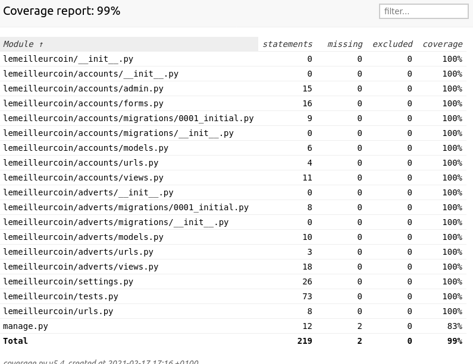

# LeMeilleurCoin

Démonstration technique Django : site de petites annonces

(Réalisé avec Python 3.9.1, environnement local avec [Pyenv](https://realpython.com/intro-to-pyenv/)

## Lqncer l'application

Pour lancer le serveur de développment :

```
pip install -r requirements.txt
python manage.py runserver
```

(Pas besoin de gérer les migrations car j'ai poussé la base de données SQLite pré-remplie avec des annonces d'exemple. Bien sûr ça n'est pas une bonne pratique hors de ce contexte.)


## Lancer les tests unitaires

```
python manage.py test
```
A titre indicatif test de couverture réalisé avec [coverage](https://coverage.readthedocs.io/en/coverage-5.4/) mais à prendre avec des pincettes.


## Pistes d'améliorations

- Set up de production : docker-compose avec une "vraie" base de données (mongo, postgres...)
- Pouvoir supprimer ou metre à jour son annonce (demande de gérer les permissions, seul le créateur de l'annonce peut la modifier)
- Enlever le reste de mélange de français/anglais car je n'ai pas surchargé la totalité des labels
- Exhaustivité et qualité des tests toujours perfectibles
- CSS
- Sécurité : les mots de passes/tokens passent en clair sur le réseau tant qu'on n'implémente pas HTTPS/SSL (pas simple avec le serveur de développement mais **obligatoire** en production)
- Sécurité : attention aux secrets dans les settings Django à ne pas pousser sur GitHub normalement (SECRET_KEY)